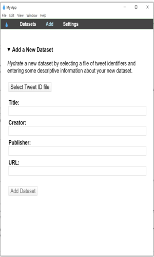
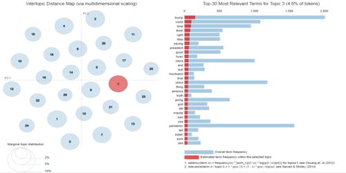
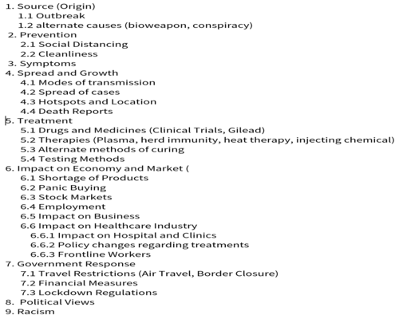
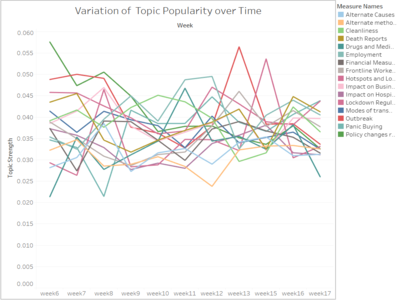

# Twitter-Analysis-of-Covid19-over-time

### TABLE OF CONTENTS
* [Objective](#objective)
* [Technologies](#technologies)
* [Algorithms](#algorithms)
* [Background](#background)
* [Data Source](#Data-source)
* [Data](#data)
* [Data Pre-processing](#Data-Pre-processing) 
* [Exploratory Data Analysis](#Explorator-Data-Analysis)
* [Implementation](#implementation)
* [Results](#results)
* [Conclusion](#conclusion)
* [References](#references)

## BACKGROUND
The COVID‑19 pandemic, also known as the coronavirus pandemic, is an ongoing pandemic of coronavirus disease 2019 (COVID‑19) caused by severe acute respiratory syndrome coronavirus 2 (SARS‑CoV‑2).[1] The disease was first identified in December 2019 in Wuhan, China.[4] The World Health Organization declared the outbreak a Public Health Emergency of International Concern on 30 January 2020 and a pandemic on 11 March.

So far an exploratory study concerning what people are tweeting about and the sentiment over different topics related to Coronavirus has not been performed. This involved working on real-time data generated from the Twitter to understand general public opinion and sentiments towards the COVID-19 pandemic. 

## OBJECTIVE
This project focuses on finding the shift in the public opinion about the coronavirus disease over time based on the texts from the social media platform, Twitter. 
A machine learning model is built to classify the users into organization or individual as we wanted to study only the individual's opinion and remove the bias added by the organizations. Implemented rule-based model Vader to obtain the sentiments of the topics over the weeks. 

## TECHNOLOGIES
Project is created with:
* Python - **pandas, gensim, Tokenizer**

## ALGORITHMS
* Sentiment Analysis
* Naive-Bayes
* GetOldTweets3
* Topic-Modelling - **Unsupervised LDA, Supervised CorEx**
* Vader

## DATA COLLECTION
* The data set contains data for Jan 1, 2020- March 31, 2020. Collected more than million tweets.
* The data contains null values in the demographics. 

The dataset collection occured in two phases-
1. Data was collected using GetoldTweets3 (https://pypi.org/project/GetOldTweets3/), an open source API.
   * Why we chose this package? 
  
     Twitter Official API has the bother limitation of time constraints, you can't get older tweets than a week. 
     
   * On a high level note, Tweets are fetched using the hashtags #COVID19, #coronasymptoms, #coronatreatment, #coronaprevention, etcetra. 
   * STEPS TO USE THE GETOLDTWEETS3 PACKAGE:
   
     Using GetOldTweets3, you can scrape tweets using a variety of search parameters such as start/ end dates, username(s), text query search, and reference location area. 
     
     
     
2. Data available from open access IEEE data source (https://ieee-dataport.org/open-access/coronavirus-covid-19-tweets-dataset)
   * tweets available are from using 90+ different keywords and hashtags that are commonly used while referencing the pandemic
   * The link explains clearly how to hydrate the data: https://programminghistorian.org/en/lessons/beginners-guide-to-twitter-data
   * Load the text file with the IDs after downloading the IEEE website or any text files if you want to fetch data using the Hydrator.
  
     
   * Save the CSV file with a new name. 
   
   * On a side note, Topic modelling is different from Machine Learning modeling in terms of data collection, that we did not want to introduce any bias, so no stratified
     sampling was done. We are mostly intersted in the topics/themes rather than classifying them. This step was different from the usual data collection methodology in building 
     Machine Learning models. 
     
     
## DATA PRE-PROCESSING
* Built a Naive-Bayes classifier by manually labeling the data into organization or individual. The model predicted with an accuracy of 80%. 

  DATA CLEANING: 
* Tokenizing, removal of stop words, removal of links, stemming was done for all the tweets data
* To remove unnecesaary words, only few POS tags are needed, I researched and included only 'NN', 'JJ', 'VB', 'RB', 'NNP', 'NNPS'
* Removed the retweets by dropping the duplicates. 
  - Manually labeled the users into organization and individual by searching the twitter handle, as well as by following the below rules
  - Tweets which has pronouns like I, me, you, etcetra are classified as individual 
  - Tweets with usernames containing health, WHO, CDC were classified as Organization
  - Manually re-iterated to check the individual profiles on twitter for classification
* Since, the twitter removes the fake accounts (not sure if they were bots or not), it throws error when we try to fetch the tweets using GetoldTweets3 for that username, hence
  programatically removed those users before further analysis. 
  
## EXPLORATORY DATA ANALYSIS 
* To get the sense of the words and their distribution, I ran the Unsupervised LDA and kept the topics as 50 initially. Using the library 'pyLDAvis', analyzed the topics that 
  are correlated and combined with the topics near to get the good seperation of the topic cloud. This ensures we get good seperation of topics.
  The following shows an example: 
  
  
   
 
## IMPLEMENTATION
* Once we get the sense of the words distribution in different topics, through the output of Unsupervised LDA as well as through research on CDC website, taking the domain
  expertise, and by understanding the topics that are occuring at that time, I created the anchor words around each topic. Broadly there were 26 topics but they could be clubbed
  toghther as follows-

  
  
* Implemented CorEx topic modelling using the anchor words. 
* Repeated the same over the weeks, and found how the opinion or the words associated with a particular topic changes over the weeks. 
* In the final step, I found the sentiment of each tweet and analysed how the sentiment is changing over the weeks for all the topics. 
   
  

## EVALUATION METRICS
 * Accuracy is used to measure the output of the Naive Bayes classifier to classify the tweets into organization or individual. 
 * For the topic modeling part, there is no evaluation metric. 
 
## CONCLUSION
* Results obtained were based on collected data over weeks. I found that people were discussing most about topics like Outbreak: 95928, 
  Spread: 91164, Racism: 85426, Travel ban: 71360, Policy changes: 66725. Topics which remained underrepresented were Alternate causes: 46123, Drug and Medicine: 41163, 
  Shortage:44204. I also observed that Negative sentiment contributes the most in overall sentiment with 643028 tweets. The Overall sentiment was jumbled up in the 
  starting weeks and clear-cut separation was observed in later weeks as in we could easily say that negative sentiments were rising up and crossing neutral and positive.

## REFERENCES
 * Michele Miller MS, Wright State University: What Are People Tweeting about Zika? An Exploratory Study Concerning Symptoms, Treatment, Transmission, and Prevention
 * Zach Wood-Doughty, Praateek Mahajan, Mark Dredze:  Johns Hopkins or johnny-hopkins: Classifying Individuals versus Organizations on Twitter

## CHALLENGES AND FUTURE WORK 
* Data collection using Getoldtweets3 has limitations on it. The maximum tweets 'GetoldTweets3' allows every hit is 10,000. Writing code by running on the VM's should 
  ensure parallel processing and faster computation. I intend to work on this and re-implement it. 
* Since, bots account for nearly 50% of the users, it is very important to identify and remove the bots before we identify the latent topics the general people are discussing 
  about. We couldn't employ this into our analysis. I am currently working on it.   

