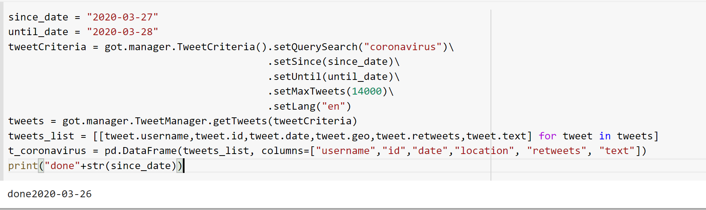

# Twitter-Analysis-of-Covid19-over-time

### TABLE OF CONTENTS
* [Objective](#objective)
* [Technologies](#technologies)
* [Algorithms](#algorithms)
* [Background](#background)
* [Data Source](#Data-source)
* [Data](#data)
* [Implementation](#implementation)
* [Results](#results)
* [Conclusion](#conclusion)
* [References](#references)

## TECHNOLOGIES
Project is created with:

* Python - **pandas, gensim, Tokenizer**
* GetOldTweets3
* Topic-Modelling

  -Unsupervised LDA
  
  -Supervised   CorEx
* Vader

## ALGORITHMS
* Sentiment Analysis
* Naive-Bayes

## BACKGROUND
The COVID‑19 pandemic, also known as the coronavirus pandemic, is an ongoing pandemic of coronavirus disease 2019 (COVID‑19) caused by severe acute respiratory syndrome coronavirus 2 (SARS‑CoV‑2).[1] The disease was first identified in December 2019 in Wuhan, China.[4] The World Health Organization declared the outbreak a Public Health Emergency of International Concern on 30 January 2020 and a pandemic on 11 March.

So far an exploratory study concerning what people are tweeting about and the sentiment over different topics related to Coronavirus has not been performed. This involved working on real-time data generated from the Twitter to understand general public opinion and sentiments towards the COVID-19 pandemic. 

## OBJECTIVE
This project focuses on finding the shift in the public opinion about the coronavirus disease over time based on the texts from the social media platform, Twitter. 
A machine learning model is built to classify the users into organization or individual as we wanted to study only the individual's opinion and remove the bias added by the organizations. Implemented rule-based model Vader to obtain the sentiments of the topics over the weeks. 

## DATA
The dataset collection occured in two phases-
1. Data was collected using GetoldTweets3 (https://pypi.org/project/GetOldTweets3/), an open source API.
   * Why we chose this package? 
   
     Twitter Official API has the bother limitation of time constraints, you can't get older tweets than a week. 
   * On a high level note, Tweets are fetched using the hashtags #COVID19, #coronasymptoms, #coronatreatment, #coronaprevention, etcetra. 
   * STEPS TO USE THE GETOLDTWEETS3 PACKAGE:
   
     Using GetOldTweets3, you can scrape tweets using a variety of search parameters such as start/ end dates, username(s), text query search, and reference location area. 
 
     
2. Data available from open access IEEE data source (https://ieee-dataport.org/open-access/coronavirus-covid-19-tweets-dataset)
   * tweets available are from using 90+ different keywords and hashtags that are commonly used while referencing the pandemic
   * https://programminghistorian.org/en/lessons/beginners-guide-to-twitter-data - The link explains clearly how to
   
      

## CHALLENGES AND FUTURE WORK 

* Data collection using Getoldtweets3 has limitations on it. The maximum tweets 'GetoldTweets3' allows every hit is 10,000. Writing code by running on the VM's should 
  ensure parallel processing. I intend to work on this and re-implement it. 
  

The data for the project was collected manually. First a cohort of 150 individuals were selected. After setting constraints on the minimum number of instagram posts, stratified sampling with age and gender a group of 50 depressed individuals(self-reported on instagram) were selected and analyzed. Another set of 50 non-depressed individuals were identified using matched pairs methodogy. With the data being sensitive to the users, I am not sharing the data on GitHub.

The data was pulled using https://github.com/instaloader/instaloader for all the individuals. The project only deals with instagram accounts which are public as private accounts cannot be scraped without becoming friends with them on Instagram.

Emoji analysis from Text
skfk
